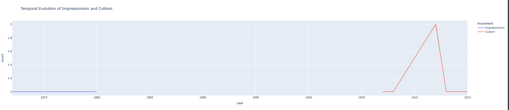
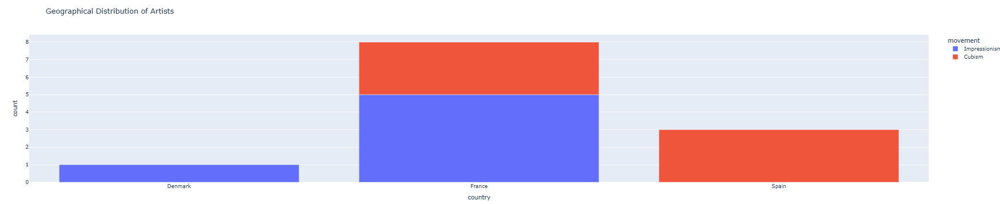
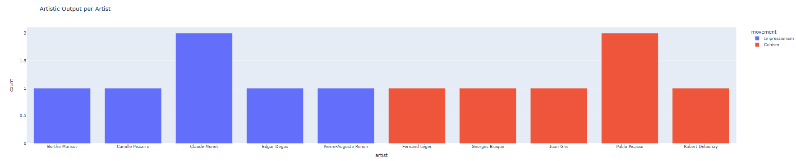
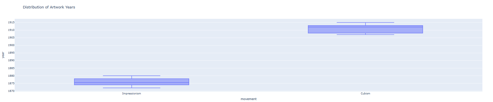

# 🎨 From Light to Structure  
## A Data-Driven Analysis of Impressionism and Cubism

This project explores the transition from Impressionism to Cubism through a data-driven approach, combining art historical interpretation with visual analytics.

---

## 🔍 Research Question

How do Impressionism and Cubism differ in terms of temporal development, geographical distribution, and artistic output?

---

## 🧰 Tools & Technologies

- Python  
- Pandas  
- Plotly  
- Google Colab (Jupyter Notebook environment)
---

## 📊 Dataset

The dataset is based on publicly available museum collections (e.g. MET, MoMA), enriched with manually assigned movement classifications.

---

## 📈 Key Analyses

### 1. Temporal Evolution
A timeline analysis reveals the overlap and transition between Impressionism and Cubism.

### 2. Geographical Distribution
Mapping artist nationalities highlights the central role of France in both movements.

### 3. Artistic Output Comparison
A comparative analysis of artwork counts suggests differences in production patterns between the two movements.

---

## 💡 Key Insights

- Impressionism and Cubism partially overlap in time, suggesting a gradual transition rather than a strict break  
- France emerges as a dominant cultural center  
- Cubist artists show a tendency toward higher experimental output  

---

## ⚠️ Limitations

- Limited number of artists included  
- Movement classification is manually assigned  
- Dataset does not fully represent total artistic production  

---

## 🚀 Future Work

- Expand dataset using additional museum APIs  
- Apply machine learning for style classification  
- Include image-based analysis  

---

## 📷 Preview

### Temporal Evolution

### Geographical Distribution

### Artistic Output

### Distribution

---

## 🤝 About Me

I am a PhD Art Historian specializing in Bulgarian Revival painting and the Samokov School of icon painters — one of the most significant traditions of Orthodox iconography in the Balkans. This doctoral background in visual and iconographic analysis forms the foundation of my current work in Digital Art History, where I combine art historical expertise with computational tools to explore visual culture through data.
---

## 🔗 Project Notebook
https://colab.research.google.com/drive/1nI3iUHxUr6rGPwTK4TwNz4rQK-Hx2398#scrollTo=LmpJVy6kPOb5
